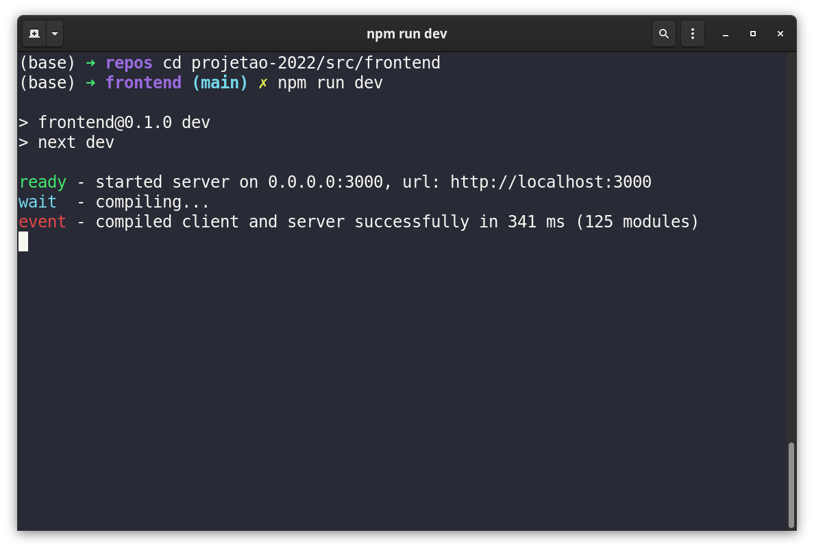
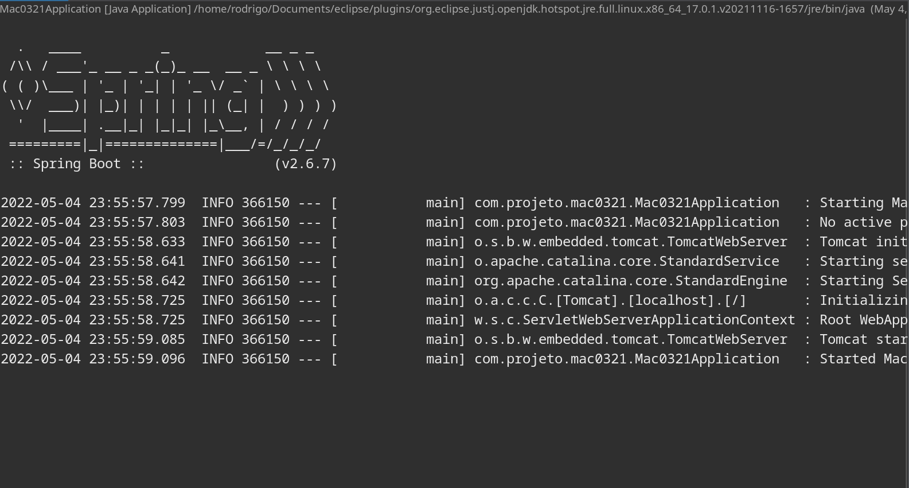
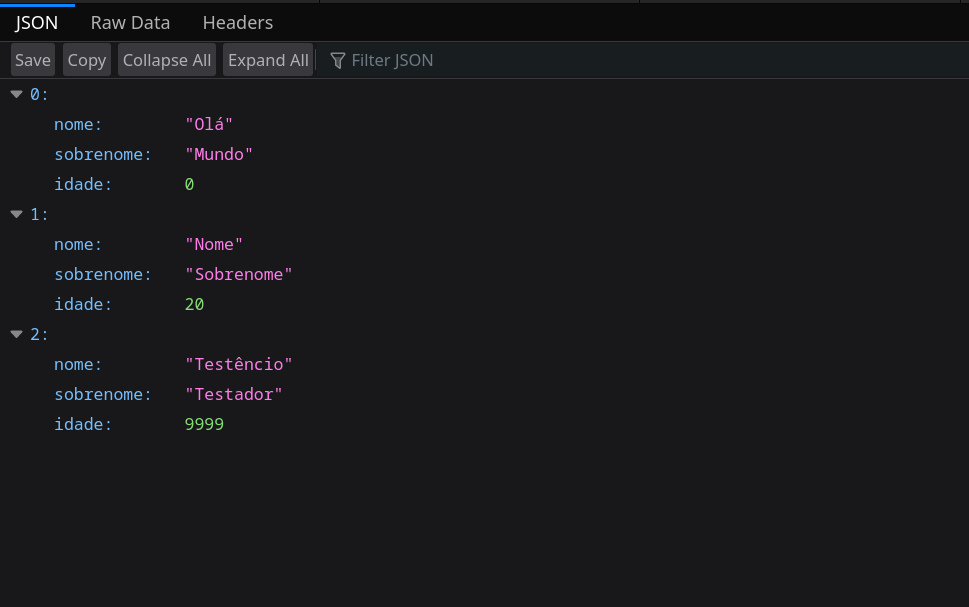

# Projetão 2022

Projetão Semestral da disciplina MAC0321. Consistirá no desenvolvimento de um sistema web.

# Participantes
- Rodrigo Sales Marcolin
- Thiago Antici Rodrigues de Souza
- Italo Roberto Lui
- Ian Andrade de Magalhães
- Keith Ando Ogawa
- Raul Ribeiro Shan Tai

# Como funciona

Neste projeto, implementaremos um _FrontEnd_ desaclopado do _BackEnd_. Uma _REST API_ será construída no _BackEnd_, em Java, através do _framework_ SpringBoot. Já o _FrontEnd_ será feito usando o Next.js.

Será necessário rodar os dois serviços ao mesmo tempo. O Next.js, por padrão, serve as páginas do _FrontEnd_ na porta `3000`. Já o SpringBoot costuma servir seus _endpoints_ na porta `8080`.

Uma vez que ambos estiverem funcionando, você acessará `localhost:3000` para interagir com o nosso serviço web. Ele se encarregará de fazer requisições à API rodando na porta `8080`. Caso algum dos dois não esteja rodando, o nosso serviço simplesmente não funcionará.

# Como rodar o projeto
## Requisitos
- node.js (v16.14.0)
- npm (v8.3.1)
- EclipseIDE 2021-12 (4.22.0)

Obs: Pode ser que o projeto rode utilizando outras versões dos programas acima. Entretanto, não garantimos que isso sempre irá ocorrer.

## Passo-a-Passo
1. Clone o repositório: `git clone https://gitlab.com/lab-poo/projetao-2022.git`
2. Navegue até a pasta: `cd projetao-2022/src/frontend`
3. Com os requisitos instalados, rode o comando: `npm run dev`. Você deve ver algo parecido a imagem abaixo. Isto indica que o _Front_ já está sendo servido. Visite a url indicada.

4. Abra o Eclipse e importe o projeto dentro da pasta _projetao-2022_. Execute a aplicação _Mac0321Application.java_. Você deve ver, no console do Eclipse, algo parecido com a imagem abaixo.

5. Para verificar se o _BackEnd_ está rodando corretamente, visite o endpoint "/test" da sua url. Caso tudo esteja correto, você deverá receber um JSON parecido com:

